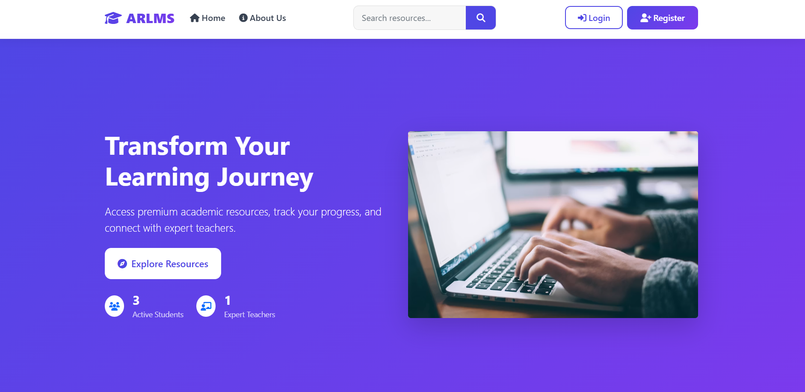

# Academic Resource & Learning Management System (ARLMS)

A web-based Academic Resource & Learning Management System developed using **Python** and **Django**. The system enables administrators, teachers, and students to manage and access academic resources through a secure, role-based platform.

## Features

- User authentication and authorization
- Role-based access (Admin, Teacher, Student)
- Upload and manage study materials
- Assignment management
- Notice management
- Search and download academic resources
- User profile management
- Responsive and user-friendly interface

## Technologies Used

- Python
- Django
- HTML
- CSS
- Bootstrap 5
- JavaScript
- SQLite

## User Roles

- **Admin** – Manage users, resources, notices, and assignments.
- **Teacher** – Upload study materials, assignments, and notices.
- **Student** – Access, search, and download learning resources.

## Installation

1. Clone the repository:

```bash
git clone https://github.com/YOUR_USERNAME/academic-resource-learning-management-system.git
```

2. Navigate to the project directory:

```bash
cd academic-resource-learning-management-system
```

3. Install dependencies:

```bash
pip install -r requirements.txt
```

4. Run the development server:

```bash
python manage.py runserver
```

## Screenshot



## Author

Ganesh D.C.